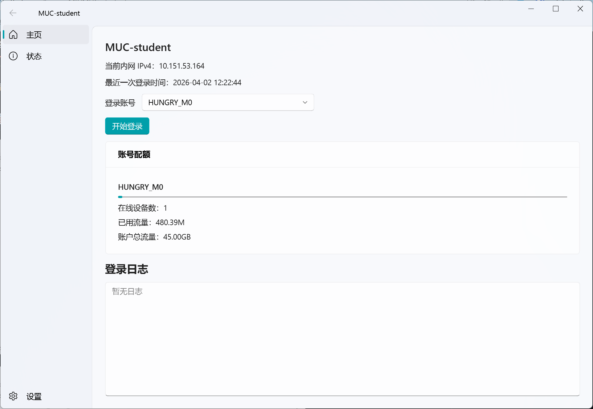
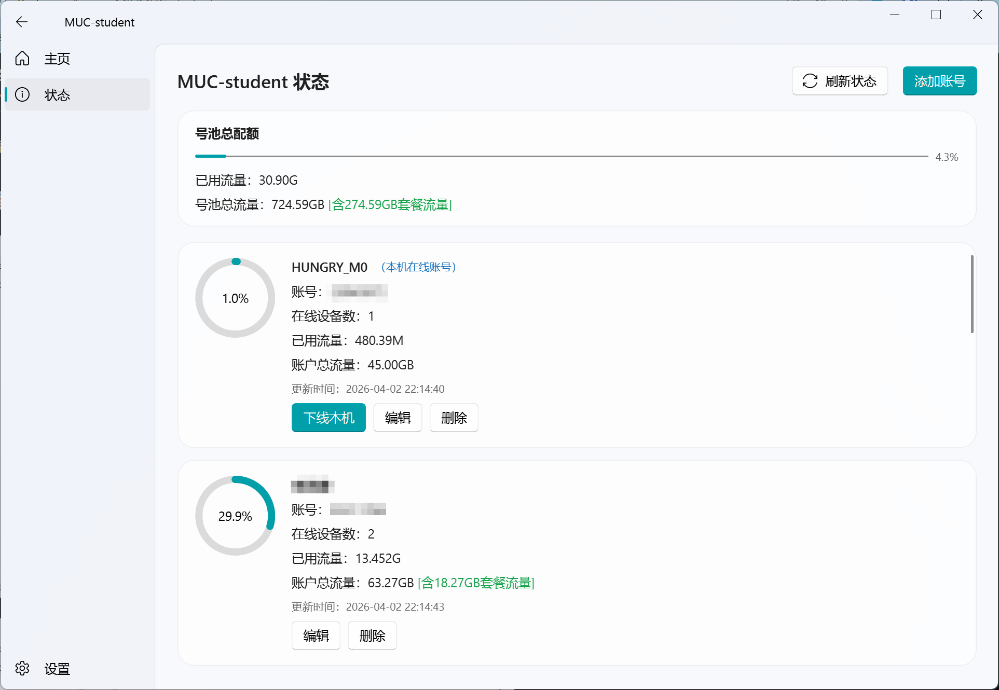
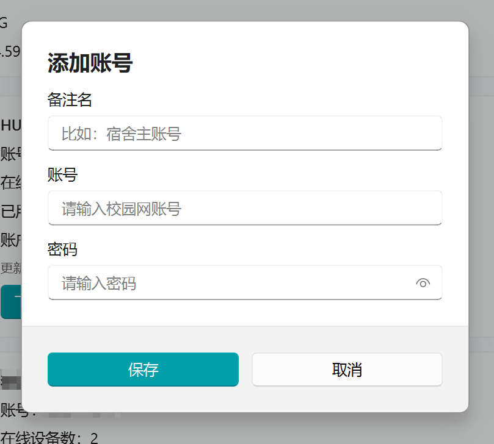
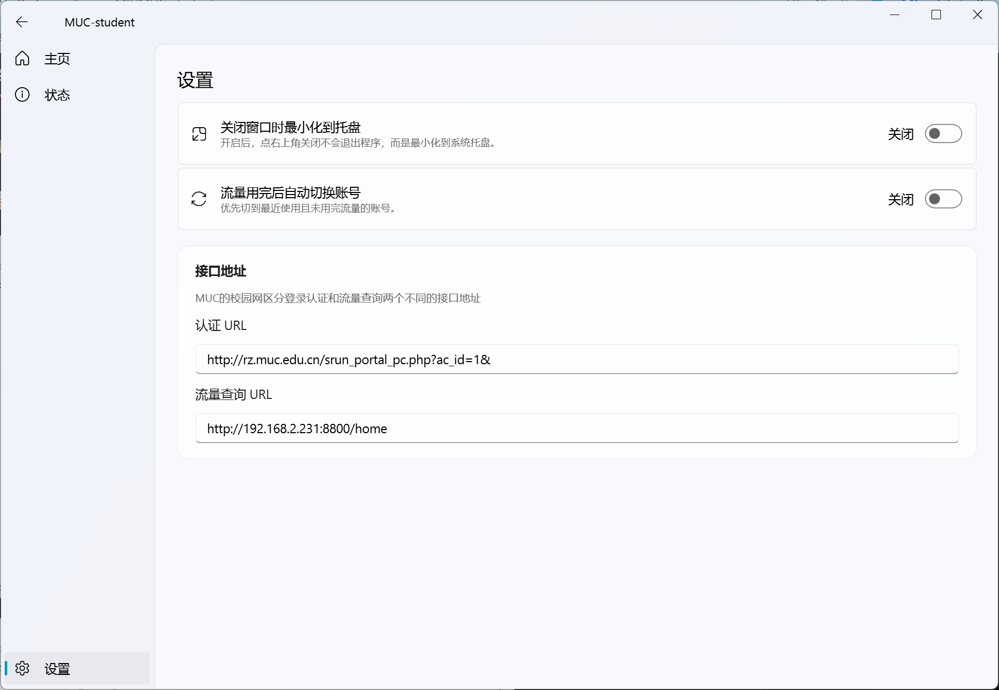

# MUC-student

适用于MUC的校园网多账号拼车程序，基于 QFluentWidgets 组件库实现 GUI 视图。通过组团拼车可以共享校园网账号的流量配额，适合寝室内共享流量等使用场景。

> [!CAUTION]
> 所有账号信息在本地明文存储，请勿将账号密码分享给不信任的人！

## 下载使用

> [!TIP]
> 请从 [Release](https://github.com/MUC-Student/MUC-student/releases/latest) 下载最新版本的可执行文件

## 界面截图

## 功能
- **多账号管理**：支持添加、编辑、删除多个校园网账号，方便共享使用
- **自动切号**：支持当前账号流量耗尽时自动切号，保证网络持续可用 
- **在线设备监控**：实时显示每个账号当前在线设备数量
- **流量配额计算**：实时显示每个账号的剩余流量配额、购买的套餐信息
