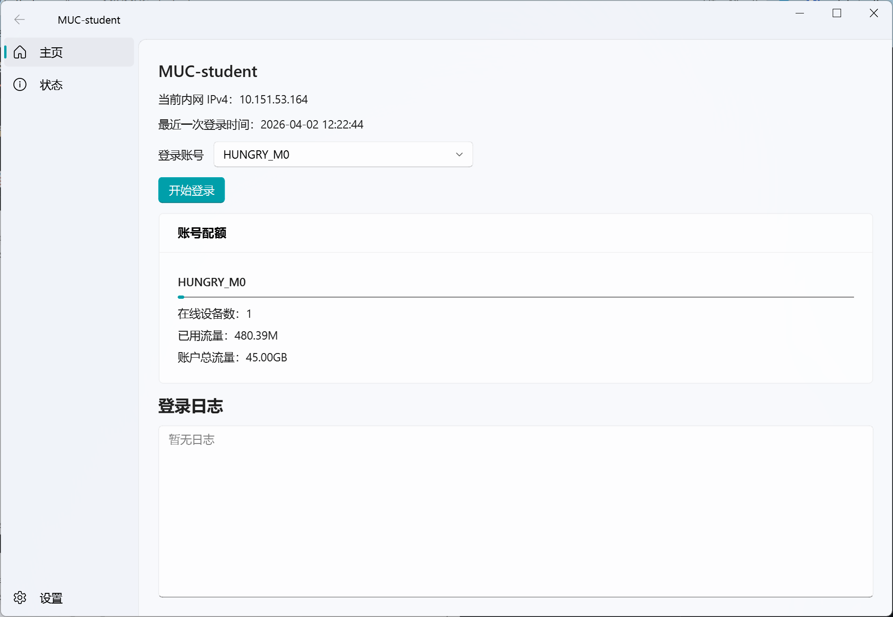
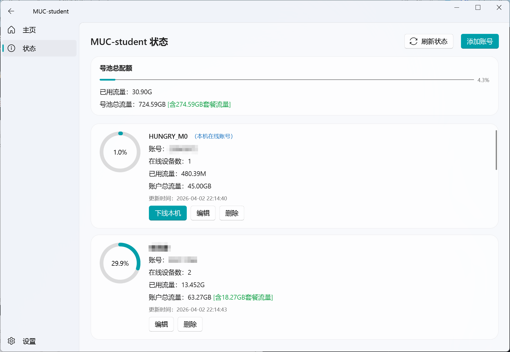
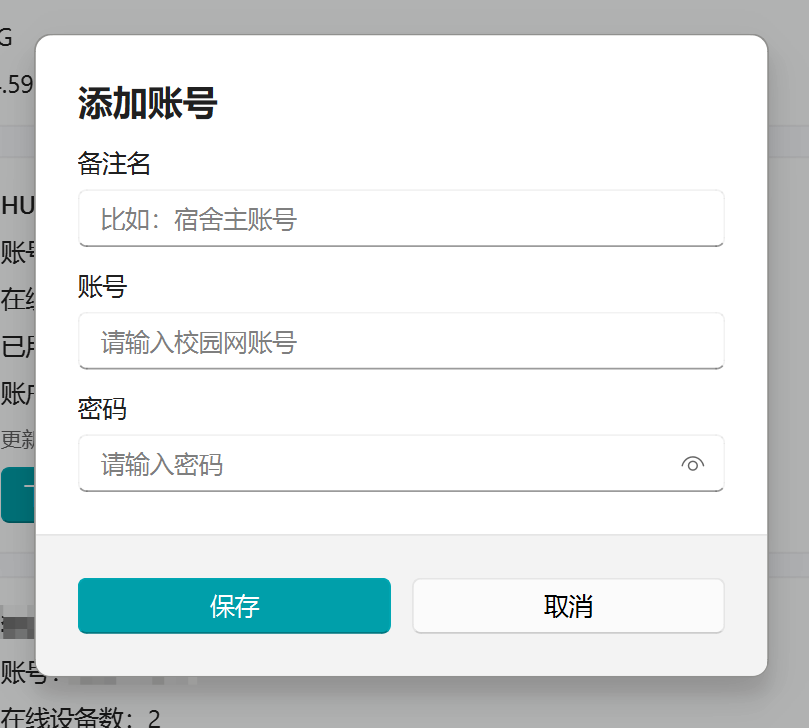
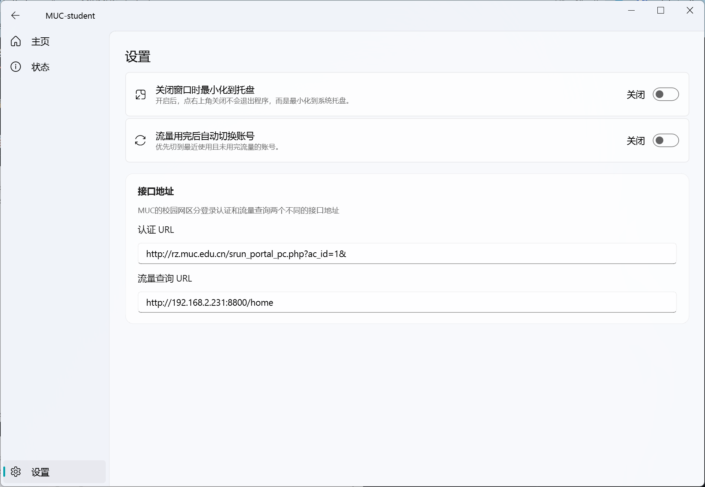

# MUC-student

适用于 MUC 校园网多账号拼车的桌面应用，节省网费

> [!NOTE]
>
> 这是一个前端学习的个人练手项目。
>
> 仅供学习交流，**请不要将账号密码告诉不信任的人！**

## 界面截图

| 主页 | 状态 |
| --- | --- |
|  |  |
| 添加账号 | 设置 |
|  |  |

## 功能

- 多账号添加、编辑、选择登录
- 校园网自动认证、自动重试登录
- 流量配额汇总和账号配额展示
- 流量用尽后自动切号
